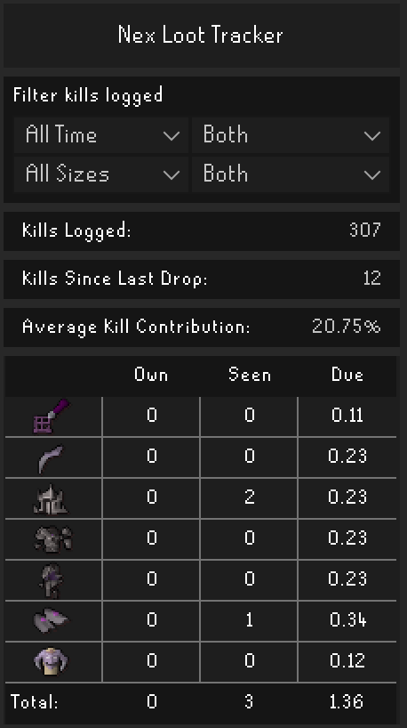
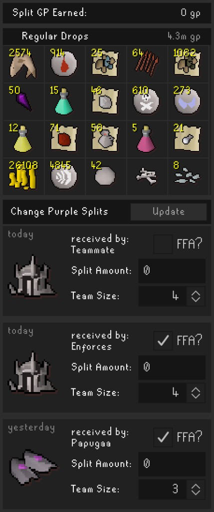

# Nex Loot Tracker

A RuneLite plugin that tracks Nex kills, personal loot, team unique drops, and split/FFA GP. 

## Screenshots
<p align="center">
  
  &nbsp;&nbsp;
  
</p>
  

## Chat commands

Type these in public, friends, or clan chat to share your Nex dry stats. Counts come from your **saved kill logs** (the same data as the side panel), not a separate counter.


| Command                      | What it shows             |
| ---------------------------- | ------------------------- |
| `!nexdry` or `!nexdrystreak` | Personal dry and team dry |
| `!nexlast` or `!nexlastitem` | Last personal unique only |


Example after typing `!nexdry`:

```text
Nex Dry Streak - Personal: 120 / Team: 45
```

- **Personal** — kills since *you* last received a unique (including Nexling)
- **Team** — kills since *anyone* on your team last received a unique (same idea as **Kills Since Last Drop** in the panel)


### Who can see the rendered message?

Everyone in chat sees you type `!nexdry`. The styled dry-streak line only appears for players who also have **Nex Loot Tracker** installed. Without the plugin, they just see the raw command text.

## Due rates

The **Due** column answers a simple question: *based on how much damage you have contributed at Nex, are you ahead or behind on uniques?*

Think of it like a progress bar toward your next personal drop:


| Due value | - What it means |
| --------- | --------------- |


- **0.50** | You are about halfway to where you would expect a drop |
- **1.00** | You are right on rate — you have done roughly enough for one drop |
- **1.36** | You are about 36% overdue (unlucky) |
- **0.00** | You either just received a drop, or got one early |

**How it is calculated**

- **Each kill adds progress** based on your damage share that kill (tracked from Nex hitsplats).  
- **MVP kills get a 10% boost** on your damage share (e.g. 20% becomes 22%), matching how Nex awards MVP.  
- **Your personal rate depends on team size and contribution.** 
Nex rolls uniques once per kill for the team (roughly **1/43** chance someone gets a unique in a full group). Your share of that roll is based on your contribution that kill, so fewer teammates means a larger share and faster Due progress. 

Equal damage examples (no MVP):

- **5-man** (~20% each) → about **1/215** per kill for you
- **4-man** (~25% each) → about **1/172**
- **3-man** (~33% each) → about **1/129**
- **Duo** (~50% each) → about **1/86**

**When you receive a personal drop**, 1.00 is subtracted from that item's Due. If you were at **1.20** when it dropped, you carry **0.20** into the next cycle instead of resetting to zero.
**The Total row** tracks any unique, using the overall team roll rate (**1/43**) scaled by your contribution each kill.

### Kill contribution

Kill contribution is your damage percentage for that fight, tracked from hitsplats on Nex. The average shown in the panel includes the **10% MVP boost** when you were MVP.